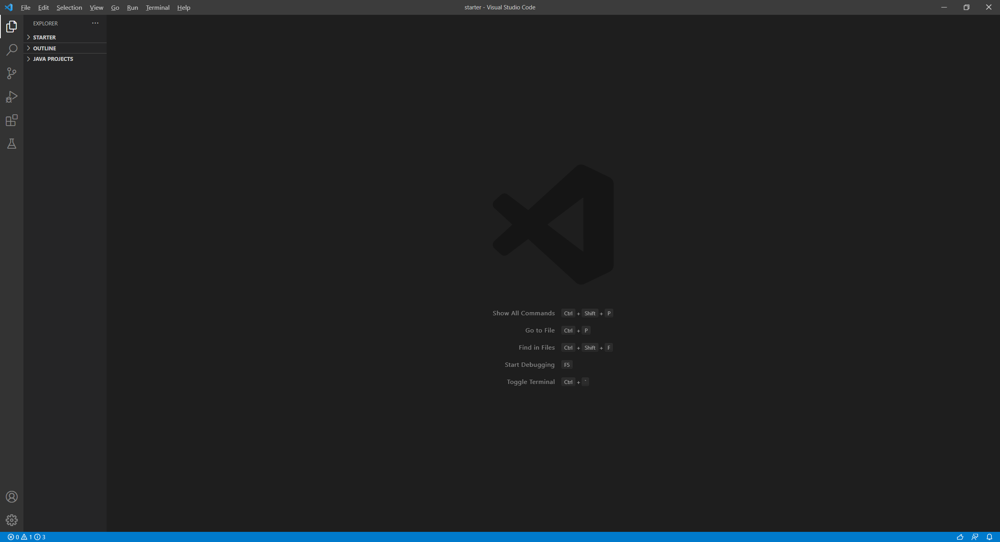
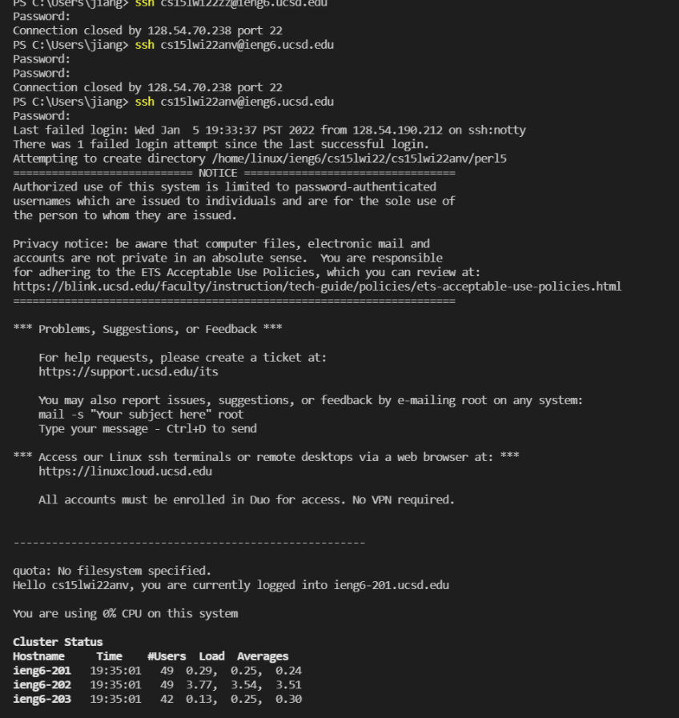
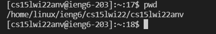
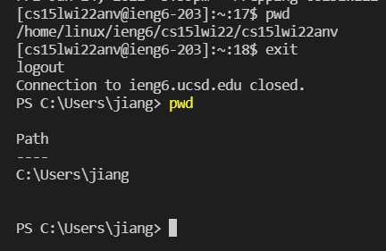
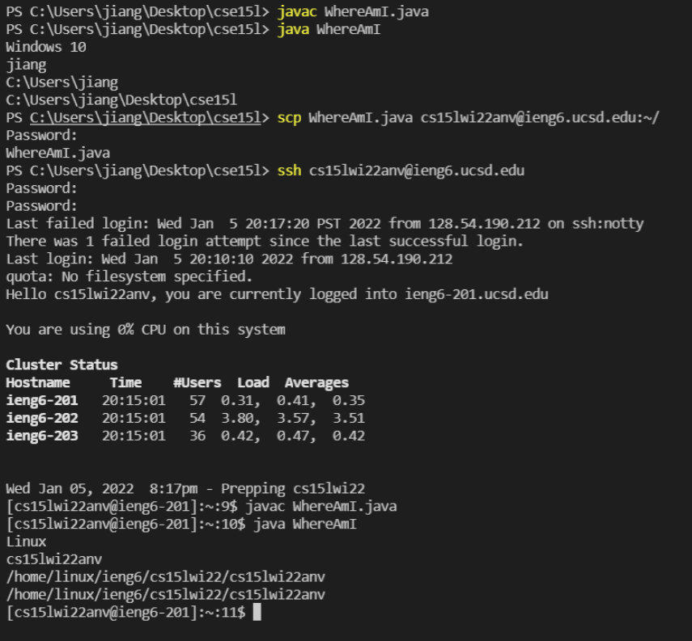
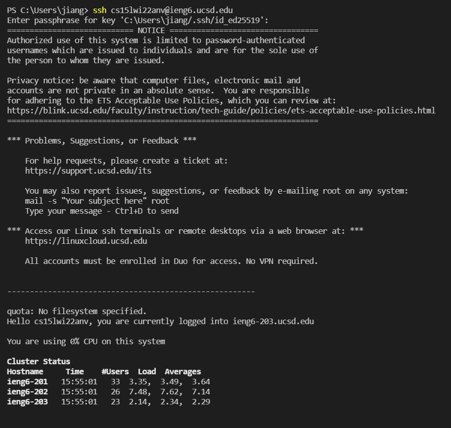
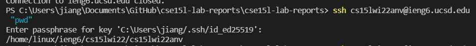

# lab report week 1

lab-report-1-week-2.md

Haochen Jiang

A17011224

## Installing VScode

[vscode link](https://code.visualstudio.com/)
this is the link to download vscode.
I download vscode and this is my screenshot of it

## Remotely Connecting

then i have to remote connect to the server using my ucsd account

`ssh cs15lwi22anv@ieng6.ucsd.edu`

this is my first time log in and it has a lot of output here

i am going to try some command here

## Trying Some Commands

i tried `pwd` i think this command is to show my current path
things change when i was typing this command using my own computer or during the remote access.

## Moving Files with scp

`scp WhereAmI.java cs15lwi22anv@ieng6.ucsd.edu:~/`

as you can see, there is a difference between the first java command and the second one. because i am running the java and javac in different client, the first one is on my own computer so it shows winows 10 and jiang, then on the server it shows linux and my username of access.

## Setting an SSH Key

I set up a passphrase so that i can login with a simple passphrase but not using long complex password

i got some trouble using this command, it let me get stuck in this, so i have to type control+c to logout, this is quite useful.

## Optimizing Remote Running

to have a passphrase make it faster to log in because my password is extremely long and my passphrase is only 6 charactors.

i can use double quotes to run commands on the server from my computer

`ssh cs15lwi22anv@ieng6.ucsd.edu "pwd"`

cosider this command's keystroke to the original situation

using double quotes command:
1. i first use "arrow up" to enter my previous command (2 keystroke)
2. then i type in my passphrase (7 keystroke)
the command run successfully
total 9 keystroke

previous:
1. i use "arrow up" to enter my previous command to connect to server and press enter (2 keystroke)
2. i type in my passphrase press enter(7 key stroke)
3. i connected, then i type in my command `pwd` and press enter(4 key stroke)
the command run successfully
total 13 keystroke

As you can see, this is faster than the original way to run command, I only have to type 1 command and my passphrase.