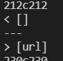

# Lab Report Week 10
Haochen Jiang

A17011224

this is the link of  [mycode](https://github.com/incisors/leo-markdownparse)

this is the link of  [joe'scode](https://github.com/ucsd-cse15l-w22/markdown-parse)
## run the test

I would need to run hundreds of tests and record them and compare
them with another implementations. To implement this, i use bash 
script that is shown in the lab, i also add another line in the bash
script `echo $file` to print the current file name so that i can know
which file am i run.

this is the bash script content:

```
for file in test-files/*.md;
do
    echo $file
    java MarkdownParse $file
done
```

and the command use to run the test and save it in the txt file:
(you can find it in the lab website)

```
bash script.sh > result.txt
```


then i have to run it in both implementations of markdownparse and record it
i record it in result.txt and results.txt

then i am using `diff` to compare them.
```
diff leo-markdownparse/results.txt labreport5/lab5/result.txt > different.txt
```


the first one in the different.txt file is mygroup's implementation, 
and the second one will be the implementation from joe.

## diff 1

the first difference appear for test case 212.md
this is the content of the file:


base on the markdown preview, the link should be `/url`
this is the result of my implementation and joe's implementation



Both implementations got the wrong results compared to the expected one.

for my implementation, the wrong is that it did not recognize the colons 
after the `]`. in my implementation, i only check the parenthesis in the
text. I should add code to check the colon.
allow some spaces after the parenthes/bracket/colons.

this is where the problem is 


in my code, the openparen should be stick with the clos bracket, and dont 
allow any spaces or something, which will continue iterate and getnothing.


## diff 2

another difference appears, this is the content
```
[foo]: <bar>(baz)

[foo]
```

the expect result should be `[]` based on the preview

this is the result of both implementation


so it seems my implementation is doing correct.

this is where i think joe's implementation is wrong:


the problem i think is that the problem is the implementation of joe 
skip the charactor of `<>` and find the text in the parenthesis as the link.
the change in the code should add if statement to check if there is `<>` 
between the close bracket and next parenthesis to fix the problem.

so joe should add a similar if statement just like indexof to check if there is 
special charactors between closebracket and openparen.


