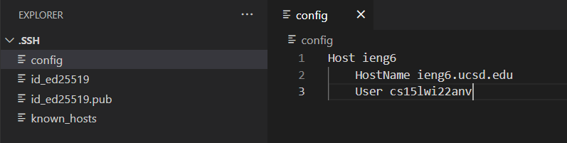
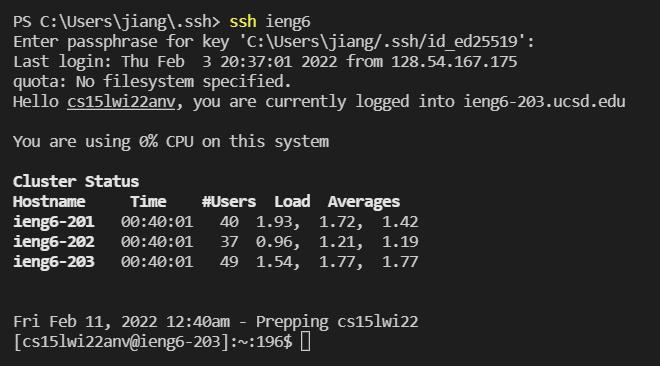
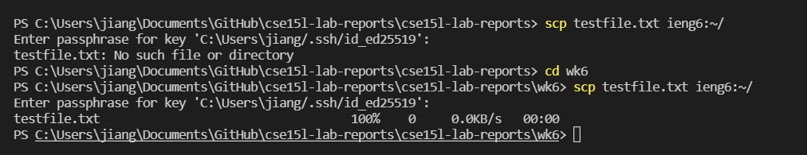

# lab report 3

Haochen Jiang

A17011224

## Part 1
Show your .ssh/config file, and how you edited it (with VScode, another program, etc)

I first got some trouble finding my .ssh file, and I search it on google.

It tell me that it should be at `C:\Users\(myusername)\.ssh`

I also find my previous file which contains my password.

I create a file named config and add the following lines:

```
Host ieng6
    Hostname ieng6.ucsd.edu
    User cs15lwi22*** (use username)
```

this is the screenshot of my vscode, shows my .ssh folder and the line i add to the config file.




## Part 2
Show the ssh command logging you into your account using just the alias you chose.

Now I am able to use the name `ieng6` to easily login to the remote server

Here is the command:
```
ssh ieng6
```

Here is the picture of logging in, I still need to enter my passphrase.




## Part 3
Show an scp command copying a file to your account using just the alias you chose.

After successfully login, i am going to try using scp to copy a testfile to my account

Here is the command:
```
scp testfile.txt ieng6:~/
```



As you can see, I first tried to type in the command but failed

Because I have to at the wk6 folder to copy the testfile.txt.

Then I type `cd wk6`

So the scp command work successfully.