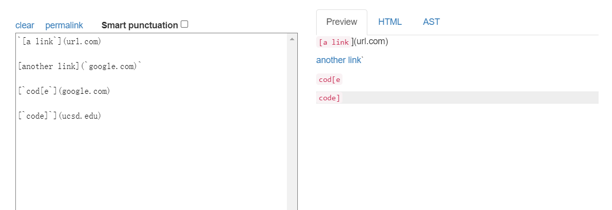
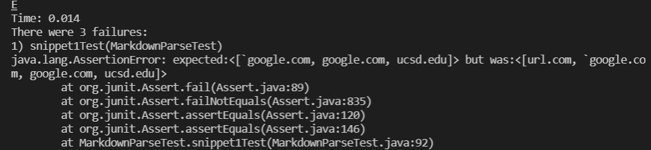
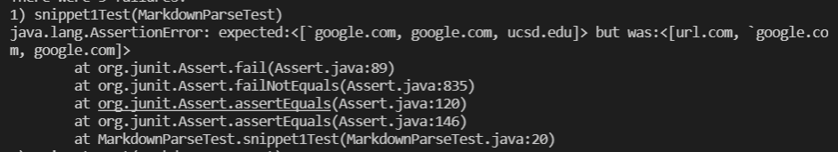
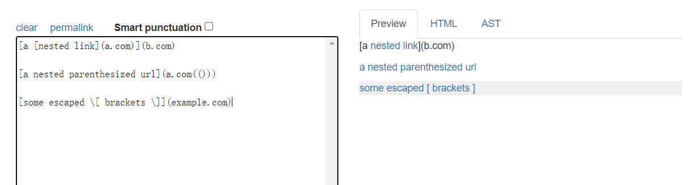
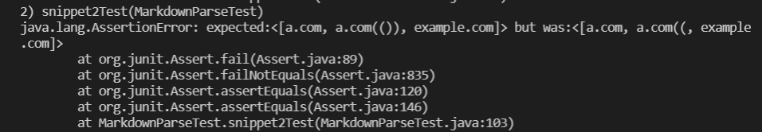
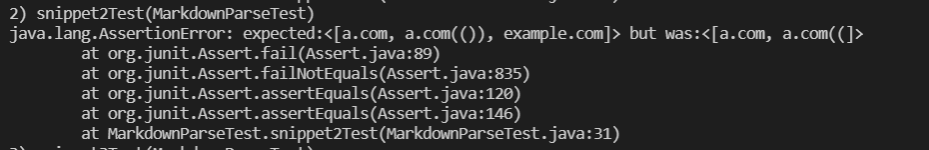
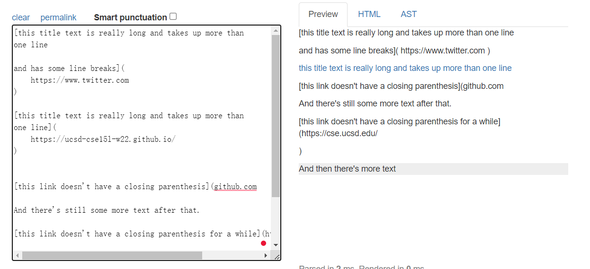
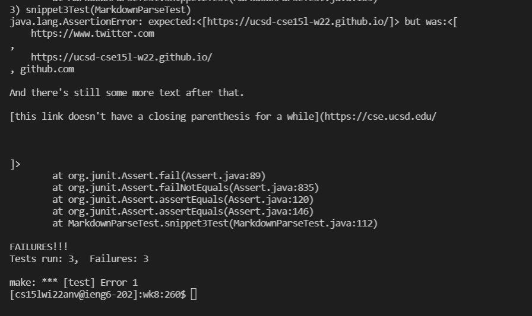
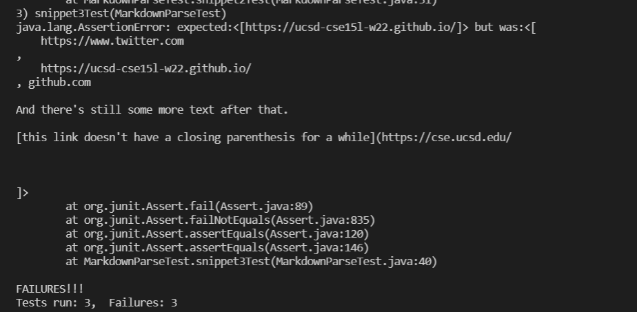

# Lab Report 3

Haochen Jiang

A17011224

Link of my code: [link](https://github.com/incisors/cse15l-lab-reports/tree/main/wk8)

Link of the reviewed code: [link](https://github.com/incisors/leo-markdownparse/blob/main/MarkdownParse.java)
## Snippet 1

The test snippet 1:
```
[a link`](url.com)

[another link](`google.com)`

[`cod[e`](google.com)

[`code]`](ucsd.edu)
```

Expect result:




This is my test on snippet 1




This is the reviewed test on snippet 1




I think it can not make a change under 10 lines to fix this because 
there is a kind of way to fix the "`" issues that is in the quiz this week:

```
    int nextOpenBracket = markdown.indexOf("[", currentIndex);
            int nextCodeBlock = markdown.indexOf("\n```", currentIndex);
            if(nextCodeBlock < nextOpenBracket && nextCodeBlock != -1) {
                int endOfCodeBlock = markdown.indexOf("\n```", nextCodeBlock);
                currentIndex = endOfCodeBlock + 1;
                continue;
            }
```

but this can not solve the problem in the last link. So fix this required more 
lines of code. So it can not be fix in 10 lines.

## Snippet 2

The test snippet 2:

```
[a [nested link](a.com)](b.com)

[a nested parenthesized url](a.com(()))

[some escaped \[ brackets \]](example.com)
```

Expect result:




This is my test on snippet 2




This is the reviewed test on snippet 2




I think the code can not be fix because based on the lab this week's fix 
and last week, it seems it is a really complex function required to solve
the nest parenthesis and brackets. And all these requires a single function
to track each pair of parenthesis. So i think it can not be fix in 10 lines.


## Snippet 3

The test snippet 3:

```
[this title text is really long and takes up more than 
one line

and has some line breaks](
    https://www.twitter.com
)

[this title text is really long and takes up more than 
one line](
    https://ucsd-cse15l-w22.github.io/
)


[this link doesn't have a closing parenthesis](github.com

And there's still some more text after that.

[this link doesn't have a closing parenthesis for a while](https://cse.ucsd.edu/


)

And then there's more text
```

Expect result:




This is my test on snippet 3




This is the reviewed test on snippet 1



I think there is a possible changes that it seems the things go wrong
when there is two "/n" in the text, so We can add several code about 
detecting if there is two "/n" next to each other and make it don't 
affect the pair of parenthesis. This could be a way of fix it.